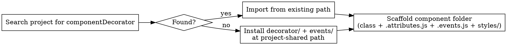

# pix Custom Element

Build Custom Elements v1 in light DOM. CSS is adopted once via `document.adoptedStyleSheets` and lifecycle is wired by a metadata-driven decorator inside a `static {}` block.

The `decorator/` and `events/` helpers are **shared across the whole project** — install them once, then every component imports from the same canonical path.

Follows pix-styleguides for HTML, CSS, and JavaScript. Uses pix-design-system tokens for visual decisions and pix-template-engine for client-side rendering.

## Hard constraints

| Rule | Reason |
|------|--------|
| No Shadow DOM | Light DOM keeps styles, slots, ARIA, and form participation natural |
| No `<template>` elements | The template engine returns strings; render via `innerHTML` or `insertAdjacentHTML` |
| CSS via `adoptedStyleSheets` | One shared `CSSStyleSheet` per component class — never re-injected per instance |
| `static {}` block as the only registration site | CSS adoption + element define + mixins run once at module load, safe for HMR |
| Metadata-driven lifecycle | `static attributes`, `static events`, `static styles` declare intent — the decorator wires the plumbing |
| `decorator/` and `events/` are project-shared | Centralised once; never copied into a component folder |

Never inject `<style>` tags inside `render`/`onRender`/`connectedCallback`. CSS belongs to `adoptedStyleSheets` only.

## Workflow: adding a new component

The fastest path is the CLI scaffolder. It handles centralisation, conflict checks, and file generation in one shot. Manual scaffolding is documented below as a fallback.

### CLI scaffolder

```bash
# autonomous element (extends HTMLElement)
node ./.github/skills/pix-custom-element/scripts/scaffold-component.mjs \
  --name "PixCard" \
  --target "<project-root>"

# customized built-in (extends HTMLDetailsElement)
node ./.github/skills/pix-custom-element/scripts/scaffold-component.mjs \
  --name "PixDetails" \
  --extends "details" \
  --attributes "open" \
  --target "<project-root>"

# first run in a brand-new project (also installs decorator/ + events/)
node ./.github/skills/pix-custom-element/scripts/scaffold-component.mjs \
  --name "PixCard" \
  --install-shared \
  --shared-dir "src/lib/custom-element" \
  --target "<project-root>"
```

The script:

1. Walks the project for an existing `componentDecorator` (skipping `node_modules`, `dist`, `build`).
2. Reuses that path when found. Otherwise installs the shared library at `--shared-dir` (only with `--install-shared`).
3. Generates the component files, computing the relative import path to the shared library.
4. Refuses to overwrite existing files unless `--force` is set.
5. Outputs a JSON report: created files, shared-library path, computed import path, suggested next steps.

Flags:

| Flag | Default | Notes |
|------|---------|-------|
| `--name` | (required) | PascalCase class name; must yield a hyphenated tag |
| `--tag` | derived | Override the kebab-case tag |
| `--target` | `cwd` | Project root |
| `--components-dir` | `src/components` | Where to put the component folder |
| `--shared-dir` | `src/lib/custom-element` | Where to install helpers if missing |
| `--extends` | (none) | Built-in tag for customized built-ins (e.g. `details`) |
| `--attributes` | (empty) | Comma list — becomes `static attributes` keys |
| `--events` | (empty) | Comma list — becomes `static events` keys |
| `--install-shared` | `false` | Copy `decorator/` + `events/` if missing |
| `--force` | `false` | Allow overwriting existing files |
| `--dry-run` | `false` | Report what would be written without writing |

Run the test suite when modifying the script:

```bash
node --test ./.github/skills/pix-custom-element/scripts/scaffold-component.test.mjs
```

### Manual workflow (when not using the CLI)

Before scaffolding any component files manually, decide where the shared helpers live.



### Step 1 — discover existing centralisation

Run one of these from the project root before creating any new component:

```bash
# Direct: find a file that exports componentDecorator
grep -rl "export function componentDecorator" --include="*.js" --include="*.mjs" \
  --exclude-dir=node_modules --exclude-dir=dist --exclude-dir=build .

# Indirect: find a `decorator/index.js` likely to be the central entry
find . -path "*/decorator/index.js" -not -path "*/node_modules/*" -not -path "*/dist/*"

# Same idea for events
find . -path "*/events/index.js" -not -path "*/node_modules/*" -not -path "*/dist/*"
```

If a result is found: that path is the canonical location. Import from there using a relative path. **Do not** copy these folders into the component directory.

### Step 2 — install once when missing

If nothing exists yet, install the helpers at a single project-shared location. Pick the path that matches the project's conventions:

| Project shape | Recommended path |
|---------------|------------------|
| Single app, `src/` | `src/lib/custom-element/` |
| Component library w/ `lib/` | `lib/custom-element/` |
| Monorepo workspace | `packages/<pkg-name>/src/lib/custom-element/` |
| Already has a "shared/utils" folder | Place `decorator/` and `events/` next to existing utilities |

Copy the contents of `scripts/decorator/` and `scripts/events/` from this skill into that single location. Confirm the destination with the user when the project shape is ambiguous.

### Step 3 — scaffold the component

A component folder contains **only** files specific to that component.

Naming convention: **folder name in PascalCase**, **file names in PascalCase** (matching the class name).

```
components/
  PixDetails/
    PixDetails.js              # class + static decorator call
    PixDetails.template.js     # TemplateEngine instance + compiled render functions
    PixDetails.consts.js       # module-level constants (enums, maps, string keys, …)
    PixDetails.utils.js        # pure helper functions with no DOM side-effects
    PixDetails.attributes.js   # { attrName: handler } — empty object {} if no observed attrs
    PixDetails.events.js       # { eventType: handler } — DOM event map
    PixDetails.css             # entry point — only @import lines or full styles
    icons/                     # optional — one .svg per icon, imported via bundle-text:
      chevron.svg
```

Folder name is `PascalCase` (matches the class). File names are `PascalCase` too. The component imports `componentDecorator` and `events` from the shared library path resolved in step 1 — never from a sibling component.

## Code-splitting rules

Every pix component **must** split its source into focused modules:

| File | What goes in it |
|------|-----------------|
| `ComponentName.js` | Class body, `static` block, lifecycle hooks only. No imports of TemplateEngine or SVG icons. |
| `ComponentName.template.js` | `TemplateEngine` instance + all `engine.html` compiled render functions. Imports SVG icons via `bundle-text:`. |
| `ComponentName.consts.js` | Named `export const` values: string keys, enum-like arrays, lookup maps. No functions, no DOM. |
| `ComponentName.utils.js` | Pure `export const` functions: validators, mappers, DOM-free utilities. May import from `consts.js`. |
| `ComponentName.attributes.js` | `export default {}` map of attribute change handlers. Always present, even when empty. |
| `ComponentName.events.js` | `export default {}` map of DOM event handlers. Always present. |
| `ComponentName.css` | Component stylesheet, imported as raw text via `bundle-text:`. |
| `icons/*.svg` | One SVG file per icon, imported as raw text via `bundle-text:./icons/<name>.svg`. No inline SVG strings in JS files. |

Anti-patterns:
- Do not define constants or helper functions inside `ComponentName.js`.
- Do not put `TemplateEngine` or `engine.html` calls inside `ComponentName.js` — they belong in `ComponentName.template.js`.
- Do not inline SVG markup as template literals in `ComponentName.js` or `ComponentName.template.js` — use `icons/*.svg` files.
- Do not put DOM logic inside `consts.js` or `utils.js`.

## Anti-patterns

- Copying `decorator/` or `events/` into every component folder.
- Importing the decorator from a sibling component (`../OtherComponent/decorator/...`). Components must not depend on each other's internals.
- Maintaining two installations of `decorator/` in the same project. Pick one canonical path; if migrating, delete the old copies in the same change.
- Hard-coding the relative path `'../decorator/index.js'` everywhere when a path alias (`@lib/custom-element`) is configured. Prefer the alias when available.

## Class skeleton

```js
import styles from 'bundle-text:./PixDetails.css';        // Parcel
// import styles from './PixDetails.css?raw';             // Vite

// SVG icons (one file per icon)
import svgChevron from 'bundle-text:./icons/chevron.svg'; // Parcel
// import svgChevron from './icons/chevron.svg?raw';      // Vite

// Import from the project-shared location (path resolved in Step 1)
import { componentDecorator } from '<shared-path>/decorator/index.js';

import { OPEN_STATES } from './PixDetails.consts.js';
import { resolveState } from './PixDetails.utils.js';
import attributes from './PixDetails.attributes.js';
import events from './PixDetails.events.js';

export class PixDetails extends HTMLDetailsElement {
  static extendsElement = 'details';   // omit for autonomous elements
  static attributes = attributes;
  static events = events;
  static styles = styles;

  static {
    componentDecorator(this);
  }

  constructor() {
    super();
    // initialise private state
  }

  // optional hooks — all called by the decorator if defined
  onRender() {}        // before onConnected, also useful for idempotent setup
  onConnected() {}     // after listeners are attached
  onDisconnected() {}  // after listeners are removed
  onAttributeChanged(name, oldValue, newValue) {} // after typed handler
}
```

The static block is the **only** site where the element is wired up.

## What the decorator does

`componentDecorator(this)` runs four steps:

1. **Adopt CSS** — when `static styles` is set, the CSS string (or `CSSStyleSheet`, or array of either) is added to `document.adoptedStyleSheets` exactly once per class (guarded with a `WeakSet`).
2. **Resolve tag** — `static isAttribute` wins; otherwise the class name is converted from PascalCase to kebab-case (e.g. `PixDetails` → `pix-details`).
3. **Safe `customElements.define`** — skips when already defined; passes `{ extends }` when `static extendsElement` is set.
4. **Apply mixins to the prototype**:
   - `componentName` = the resolved tag.
   - `handle<Name>AttributeChanged` for each entry in `static attributes`.
   - `handle<Type>Event` for each entry in `static events`.
   - `connectedCallback`, `disconnectedCallback`, `attributeChangedCallback`, `handleEvent`.
   - `observedAttributes` = `Object.keys(static attributes)`.

Generated lifecycle behaviour:

- **`connectedCallback`**: registers `this` as the EventListener for each key in `static events`, then calls `onRender?.()` then `onConnected?.()`.
- **`disconnectedCallback`**: removes those listeners, then calls `onDisconnected?.()`.
- **`attributeChangedCallback(name, oldValue, newValue)`**: dispatches to `handle<PascalName>AttributeChanged(oldValue, newValue)`, then calls `onAttributeChanged?.(name, oldValue, newValue)`.
- **`handleEvent(e)`**: dispatches to `handle<PascalType>Event(e)`. Because `this` implements the `EventListener` interface, listeners are removed cleanly without storing bound function references.

## Attributes file

```js
// PixDetails.attributes.js
import { events } from '<shared-path>/events/index.js';

export default {
  open(_oldValue, newValue) {
    const state = newValue === null ? 'closed' : 'open';
    this.setAttribute('aria-expanded', String(state === 'open'));
    events.dispatchComponentEvent.call(this, 'toggle', { state });
  },
};
```

`this` is the element. Keys become observed attributes automatically. Export `{}` when no attributes are observed — the file must still exist.

## Events file

```js
// PixDetails.events.js
import { events } from '<shared-path>/events/index.js';

export default {
  click(e) {
    if (e.target.matches('[data-action="close"]')) {
      this.collapse();
      events.cancelEvent(e);
    }
  },
};
```

Each key is a DOM event type. `this` is the element. The decorator attaches and detaches listeners across `connectedCallback` / `disconnectedCallback`.

## Bundler support — bundle-text vs ?raw

| Bundler | Import form | Notes |
|---------|-------------|-------|
| Parcel | `import s from 'bundle-text:./x.css'` | Treats the file as a UTF-8 text asset |
| Vite / Rollup w/ vite-plugin | `import s from './x.css?raw'` | `?raw` query suffix |
| esbuild | `import s from './x.css'` | Configure `loader: { '.css': 'text' }` |
| webpack 5+ | `import s from './x.css?raw'` or asset/source | `webpack.config.js` rule with `type: 'asset/source'` |

The decorator's `registerStylesheet` accepts either a CSS **string** or a pre-built **`CSSStyleSheet`** (or an array of either) — so any of those import strategies work without code changes.

## Render with pix-template-engine

Use the engine's tagged template literal to compile reusable render functions once, at module load:

```js
import TemplateEngine from '<shared-path>/template-engine/index.js';

const engine = new TemplateEngine();

const renderChevron = engine.html`<i class="pix-icon-chevron-down" aria-hidden="true"></i>`;
const renderRow = engine.html`<li>{{ label }} — {{ value }}</li>`;

// inside the class:
onRender() {
  this.querySelector('summary')?.insertAdjacentHTML('beforeend', renderChevron({}));
}
```

`engine.html` returns a `(data) => string` function. Compile once, invoke per render. Use `engine.render(filePath, data)` for file-based templates when you have larger views to compose.

## Customized built-in elements vs autonomous

- **Customized built-in** (`<details is="pix-details">`) — class extends a specific HTML element (e.g. `HTMLDetailsElement`) and sets `static extendsElement = 'details'`. CSS targets `[is="pix-details"]`. Inherits all native semantics, accessibility, and form behaviour.
- **Autonomous** (`<pix-card>`) — class extends `HTMLElement`, no `extendsElement`. CSS targets the tag itself: `pix-card { ... }`.

Safari does not natively support customized built-ins. When targeting Safari, ship the [@ungap/custom-elements](https://github.com/ungap/custom-elements) polyfill at app startup or use autonomous elements.

## CSS architecture

CSS is structured to compose cleanly under the pix-design-system layers (`reset, foundations, layout, components, helpers`). Component CSS lives inside `components` via a sub-layer per component:

```css
/* PixDetails.css */
@layer components.pix-details {
  :root {
    --pix-details--padding: var(--space-4);
    --pix-details--border-color: var(--color-border);
    --pix-details--border-radius: var(--card-border-radius, var(--radius-control));
  }

  [is="pix-details"] {
    padding: var(--pix-details--padding);
    border: 0.1rem solid var(--pix-details--border-color);
    border-radius: var(--pix-details--border-radius);
  }
}
```

Declare component-scoped tokens (`--pix-details--*`) at the top of the `@layer` block on `:root`, then map them to selectors. Use pix-design-system semantic tokens (`--space-*`, `--color-*`, `--radius-*`, `--card-*`) for the right-hand side so theme changes propagate.

Selector strategy follows pix-styleguides: prefer attributes (`[is="pix-details"]`, `[data-part="title"]`) over classes, prefer elements when semantics fit. Avoid id selectors.

## Resources

- CLI scaffolder: `scripts/scaffold-component.mjs` (+ tests in `scaffold-component.test.mjs`)
- Decorator (project-shared, install once): `scripts/decorator/index.js`
- Events utilities (project-shared, install once): `scripts/events/index.js`
- Full example component: `scripts/PixDetails/PixDetails.js`, `PixDetails.consts.js`, `PixDetails.utils.js`, `PixDetails.attributes.js`, `PixDetails.events.js`, `PixDetails.css`, `icons/`
- Styleguides: `pix-styleguides:references:javascript`, `pix-styleguides:references:css`, `pix-styleguides:references:html`
- Design tokens: `pix-design-system:references:FOUNDATIONS`
- Template engine: `pix-template-engine`

## Common mistakes

| Symptom | Fix |
|---------|-----|
| `decorator/` or `events/` copied inside a component folder | Move them to a project-shared path; update imports in every component |
| Two `decorator/` installations in different folders | Pick one as canonical, delete the others, update imports |
| Importing helpers from a sibling component (`../OtherComp/...`) | Always import from the central library path |
| Styles applied twice after HMR | Use `componentDecorator` / `registerStylesheet` — never adopt sheets manually in render |
| Listener not removed on detach | Don't store `bound` references; rely on `addEventListener(type, this)` + `handleEvent` (the decorator does this for you) |
| `customElements.define` throws on second import | Decorator skips when `customElements.get(tag)` already returns; never call `define` directly |
| CSS file imported but `styles` is `undefined` | Bundler is treating the file as a CSS module/side-effect import — switch to `bundle-text:` (Parcel) or `?raw` (Vite/webpack) |
| Inline SVG strings in `ComponentName.js` | Move each SVG to `icons/<name>.svg` and import with `bundle-text:./icons/<name>.svg` |
| Constants or helper functions defined in `ComponentName.js` | Move constants to `ComponentName.consts.js`, pure helpers to `ComponentName.utils.js` |
| Customized built-in not upgrading on Safari | Ship the `@ungap/custom-elements` polyfill at app entry |
